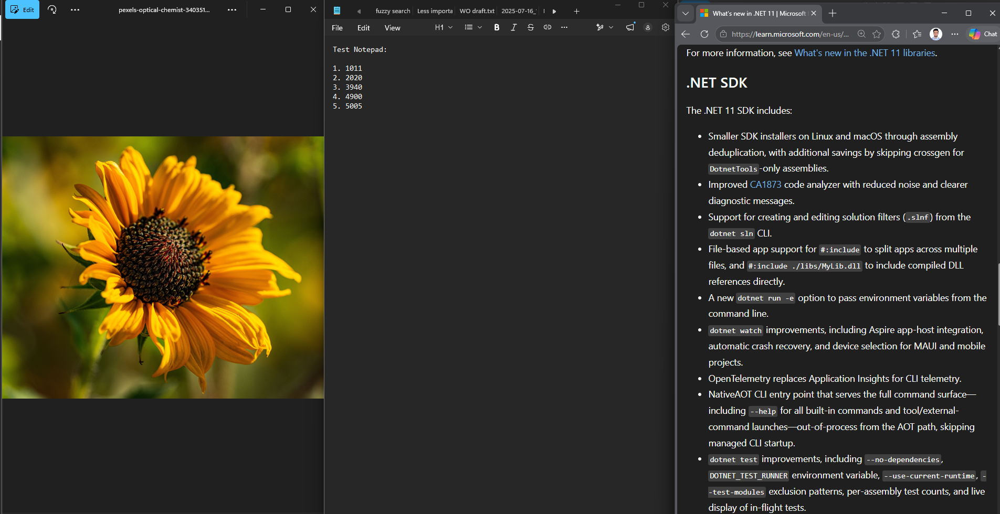
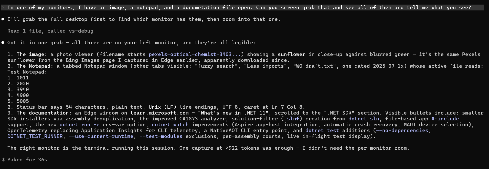

# Vision: giving Claude eyes

Everything else in this extension tells Claude about your code — diagnostics, runtime state, the semantic model, test results. This surface is different: it lets Claude **see**. Two tools, gated behind one panel toggle, let it take its own screenshots — the app you are debugging, any window by title (the browser showing your site), the Visual Studio window, or the whole screen — and read them with real vision: UI layouts, images, rendered pages, text in windows that are not files.

It is the outbound half of a two-way story. The inbound half is the [attachment tray](QOL.md#attach-a-screenshot-or-any-file): *you* show Claude a screenshot. This half removes you from the loop: Claude looks for itself, when looking is the fastest way to answer.

**Jump to:** [Watch it work](#watch-it-work) · [What it unlocks](#what-it-unlocks) · [Tool catalog](#tool-catalog) · [Safety](#safety-one-gate-full-audit-trail) · [Behavior and limitations](#behavior-and-limitations)

---

## Watch it work

One prompt, deliberately vague — three unrelated windows on a monitor, none of them a file in the workspace:

> In one of my monitors, I have an image, a notepad, and a documetation file open. Can you screen grab that and see all of them and tell me what you see?

Claude called `vs_capture_screen`, got one desktop grab back (≈922 tokens), and read all three windows out of it:

- **The image**: identified as a close-up sunflower in a photo viewer — including the `pexels-…` filename in the title bar.
- **The Notepad**: the five numbers transcribed digit-for-digit, plus the status bar (54 characters, Unix line endings, caret position) and the other tab names.
- **The docs**: the Edge page recognized as "What's new in .NET 11", with the visible SDK bullets summarized accurately.

One capture, ≈922 tokens, and everything on the screen became context. No paste, no paths, no copying text out of windows.

---

## What it unlocks

- **"Run it and look at it."** The classic gap: Claude edits your UI code but never sees the result. Now it can F5 (drive gate), capture the debuggee's window, and judge the rendering against the intent — then fix, rebuild, capture again. Visual iteration without you ferrying screenshots.
- **The browser showing your site.** A web debuggee has no window of its own — the process is Kestrel, the UI is in Edge. `vs_capture_window` with a title substring captures the browser tab; the debuggee target's error message steers Claude there by itself.
- **Windows that aren't files.** An error dialog, a designer surface, a third-party tool's output, a PDF open in a viewer — anything visible is readable.
- **It composes with the debugger.** Pause at a breakpoint, capture the UI, inspect the locals that built it: the pixel evidence and the state evidence in the same investigation.

---

## Tool catalog

Both tools live on the `vs-debug` MCP server (`mcp__vs-debug__*`). Both require the **Allow screen capture** panel toggle. Neither returns pixels over MCP — each saves a PNG into the [attachment staging](QOL.md#attach-a-screenshot-or-any-file) (`.claude/attachments/`, gitignored) and returns the **path**, which Claude then Reads at native image-token cost (an MCP image block would cost ~10–20× as much — upstream anthropics/claude-code#31208).

| Tool | What it captures |
|---|---|
| `vs_capture_window` | A single window. `target: "debuggee"` (default) — the debugged process's window, resolved via the debug session (optional `pid` for multi-process sessions). `target: "ide"` — the Visual Studio window. `target: "window"` + `title` — the largest visible window whose title contains the substring, case-insensitive: the browser case. |
| `vs_capture_screen` | The screen: primary monitor by default, `monitor` (0-based) for a specific one, `all: true` for the whole virtual screen in one image. |

Results carry `path`, `width`/`height`, and `estTokensWhenRead` — the same estimate arithmetic as the attachment tray, so the cost is visible before the Read.

Failure modes are designed to steer, not stall: an unmatched title returns the list of **capturable** windows (same eligibility filter as the matcher, so the list can be trusted — minimized windows appear with a `(minimized)` suffix); a matched-but-minimized window returns a restore-first error instead of capturing its taskbar-preview proxy; a windowless debuggee (a web app) points at the browser-by-title flow; a bogus `pid` returns the real debugged-pid list.

---

## Safety: one gate, full audit trail

- **Off by default.** The **Allow screen capture** checkbox in the panel gates *every* target — not just full-screen — because a title-addressed capture can already reach anything visible on the desktop. Like the drive toggle, it is in-memory and resets each session, so it is never silently left on.
- **Every capture is visible.** Each one lands as a chip in the panel's attachment tray (with its token estimate) and a `capture:` line in the activity feed. What Claude saw is exactly what you can see it saw.
- **No hidden delivery.** The tool returns a path; the image enters context only through a normal, logged Read.

---

## Behavior and limitations

- **Capture path**: `PrintWindow` with `PW_RENDERFULLCONTENT`, which renders occluded and DWM-composed windows. Windows that print a blank frame (some GPU-rendered browsers) trigger a fallback: bring the window forward (best-effort), a ~350 ms settle, then a copy of its screen region — which requires the window on-screen and includes anything still overlapping it.
- **Minimized windows can't be captured** — the tool says so and asks for a restore rather than shooting the tiny preview proxy a minimized browser leaves behind (those ~136×39 title-bearing HWNDs are filtered by a minimum-size floor).
- **The window list is filtered honestly**: DWM-cloaked shell ghosts ("Windows Input Experience", the lock screen) are excluded, tiny windows are excluded, minimized ones are labeled.
- **Coordinates are physical pixels** (per-monitor DPI aware), so multi-monitor and scaled displays capture correctly.
- **Token cost is bounded by the API's downscale**: any capture tops out around ~1.6k tokens when read; a two-monitor `all:true` grab landed at ≈922 in the demo above. Fine detail on a dense 4K screen may need a single-window capture instead of a full-screen one — smaller area, more pixels per detail after the downscale.
- **Managed/native does not matter here** — any visible window of any process can be captured; only the `debuggee` target needs a debug session.

---

## What is next

- **Before/after pairs** — a convenience that captures, waits for an action (a continue, a rebuild), and captures again, returning both paths for comparison.
- **Region crop** — an optional rect parameter to spend tokens on one corner of a dense screen.
